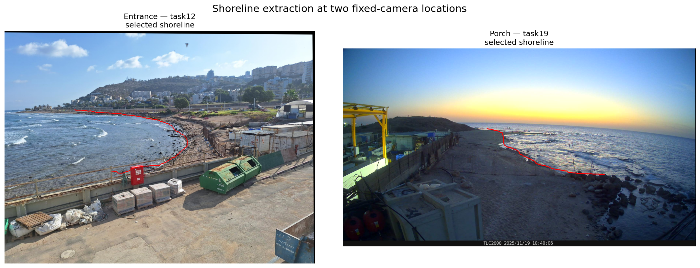

# Nir David-Duani

Computer Science student focused on **algorithms, computer vision, and applied AI systems**.

---

# Featured Projects

## Coastal Shoreline Detection
**Python · PyTorch · OpenCV · CLIPSeg · SIFT · Computer Vision**
A semi-automatic system for extracting shorelines from fixed coastal cameras.
Each incoming frame is aligned with a location reference using **SIFT feature
matching, RANSAC, and homography estimation**. A vision-language segmentation
model then produces water and land probability maps, from which the system
extracts a connected shoreline inside a user-defined search region.
The project supports curved and irregular shorelines without assuming a fixed
shore direction.
### Shoreline Results

### Registration and Semantic Pipeline

  
  

Key components:
- Reference-frame registration with SIFT and RANSAC
- Water/land segmentation using CLIPSeg text prompts
- Interactive search-region annotation
- Two-dimensional contour extraction and candidate scoring
- CLI workflows for single-image and batch processing
- Interactive notebook for parameter tuning and pipeline inspection
[View repository →](https://github.com/Nir-David-Duani/coastal-shoreline-detection)

## Deep Learning: From Classification to Detection
**Python · PyTorch · Computer Vision · Deep Learning**

A deep learning project exploring the transition from **image classification to object detection** using transfer learning.

Starting from a pretrained **ResNet-18 classifier**, the system evolves through three stages:

- **Backbone analysis** – studying ResNet-18 as a feature extractor and analyzing its feature hierarchy  
- **Single-object detection** – adapting the classifier to regress a bounding box for a safety vest  
- **Multi-object detection** – extending the model to detect **helmet, person, and vest** using a fixed-slot architecture  

The project focuses on **architectural reasoning, detection loss design, and IoU-based evaluation**.

### Single-Object Detection (Safety Vest)

  
  

A ResNet-18 backbone with a lightweight regression head predicts a **single normalized bounding box per frame**.

### Multi-Object Detection (Helmet · Person · Vest)

  
  

The detector predicts **up to three objects per frame** using fixed prediction slots and an **IoU-aware loss** for improved localization.

Repository  
https://github.com/Nir-David-Duani/classification-to-detection

---

## Planar Augmented Reality
**Python · OpenCV · Camera Geometry · Pose Estimation**

An augmented reality pipeline that tracks planar targets in video and renders virtual content with correct **perspective, camera pose, and occlusion handling**.

The system combines **camera calibration, homography tracking, and pose estimation (solvePnP)** to align virtual 3D objects with the real scene.

### Occlusion Handling

### Multi-Plane Tracking

  
  

### Cube Rendering (Pose Estimation)

Repository  
https://github.com/Nir-David-Duani/augmented-reality-planar

---

## Lane Detection from Driving Videos
**Python · OpenCV · Computer Vision**

A computer vision system for detecting **lane boundaries and road structure** in driving videos across multiple scenarios including curved roads, crosswalks, and lane changes.

The project emphasizes **geometric reasoning, temporal consistency, and robustness across environments**.

### Crosswalk Detection

### Lane Tracking and Lane Change Detection

### Curved Lane Detection

### Night Driving Scenario

Repository  
https://github.com/Nir-David-Duani/lane-detection

---

## Perfect Phylogeny (PP-Linear)
**Java · Algorithms · Graph Algorithms**

An implementation of the **Unrooted Perfect Phylogeny algorithm** with **O(n · m)** time complexity, focusing on algorithmic correctness and computational efficiency.

Repository  
https://github.com/Nir-David-Duani/pp-linear

---

# Technical Focus

- Computer Vision
- Deep Learning for Visual Recognition
- Algorithms and Data Structures
- Geometry and Optimization

---

# Contact

LinkedIn  
https://www.linkedin.com/in/nir-david-duani

GitHub  
https://github.com/Nir-David-Duani
